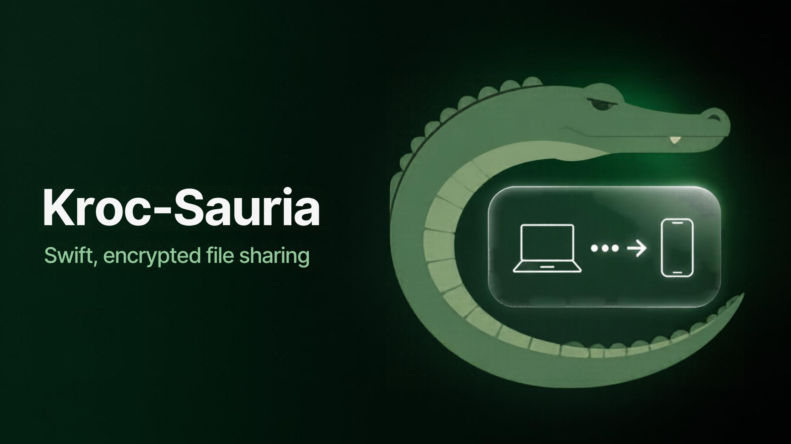
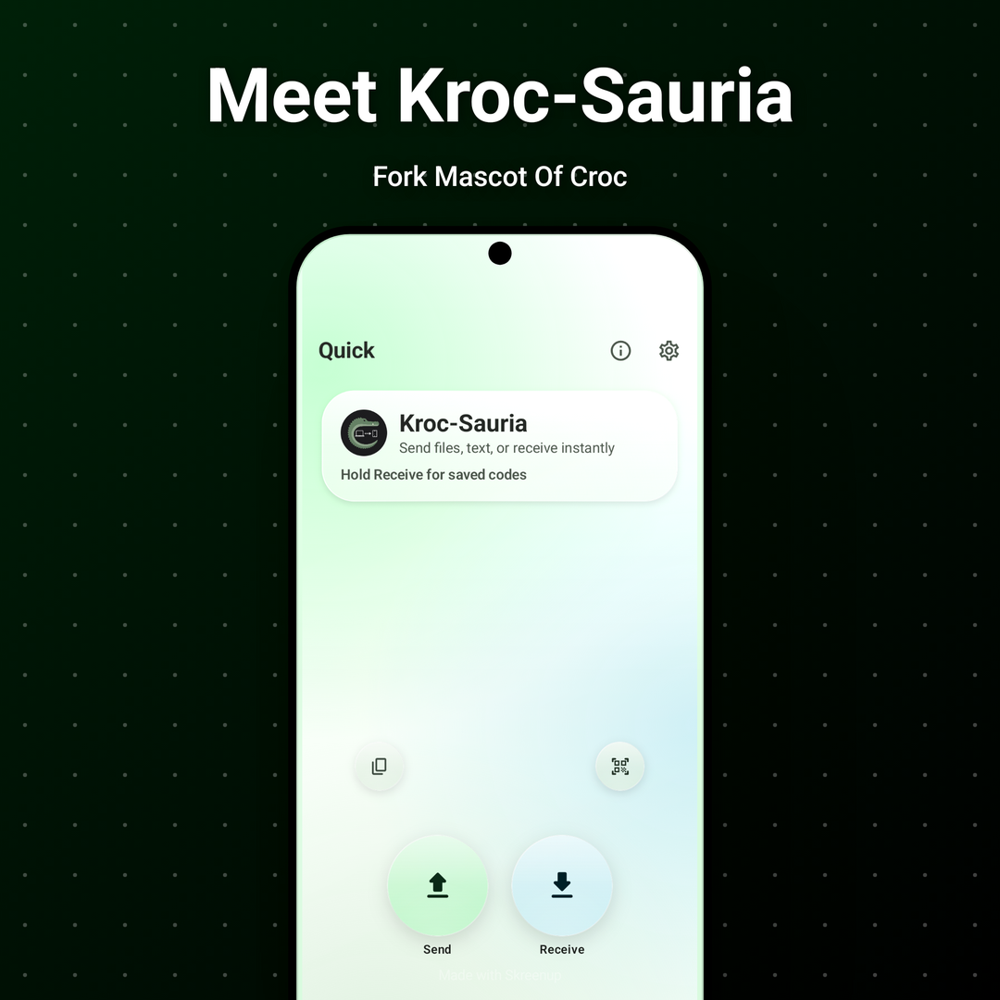
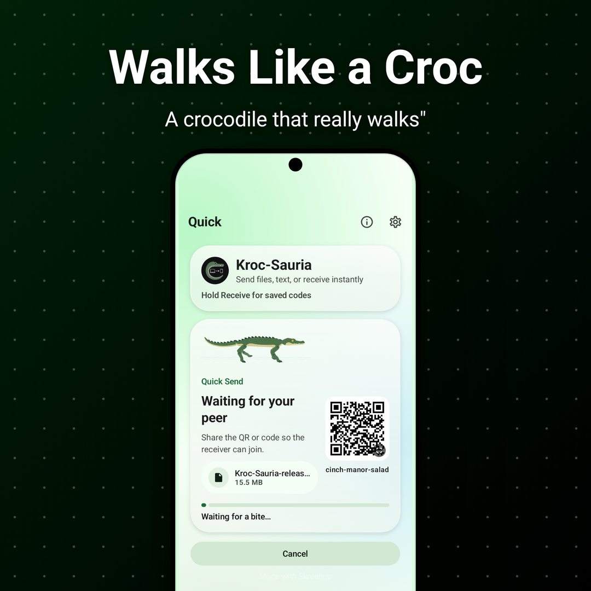
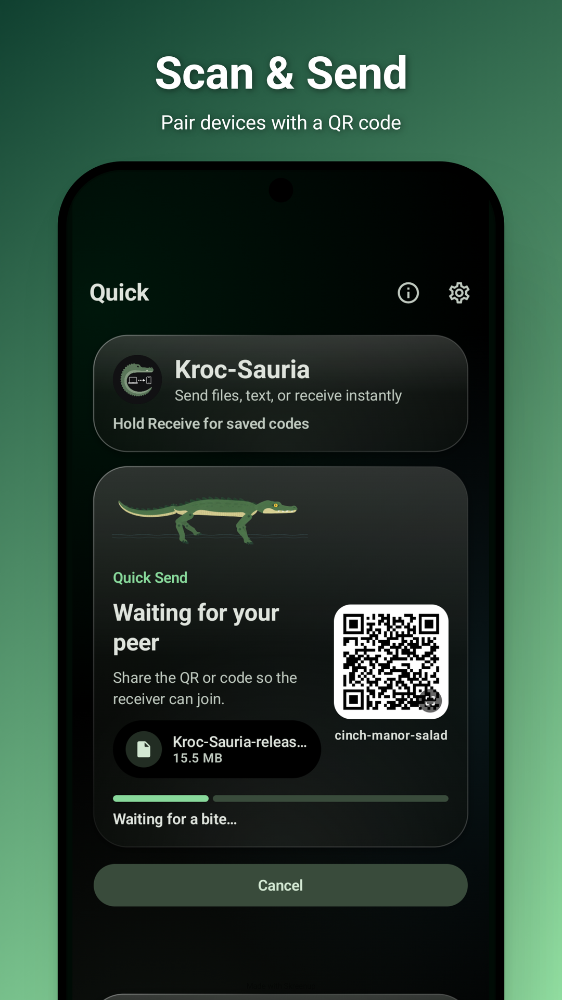
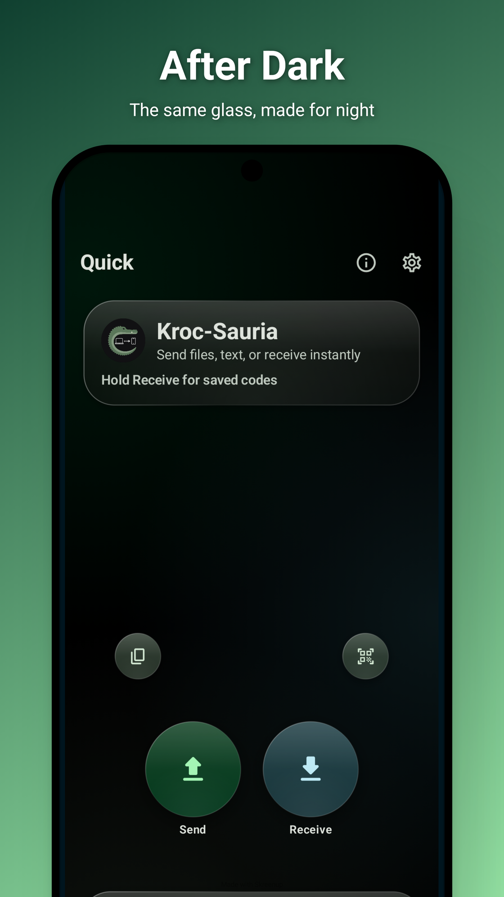

  

<h1 align="center">Kroc-Sauria</h1>

  <strong>Minimalist file sharing across devices.</strong> 
  Kotlin · Jetpack Compose · Material 3

---

## ✦ About

- Android client for [Croc](https://github.com/schollz/croc) file transfers
- Fork of the Android Croc client by [Dking08](https://github.com/Dking08)
- This fork: new look, mascot and animations — transfer features unchanged

## ✦ Features

- 📤 Send files, folders and text
- 📱 QR code pairing
- 🔐 Saved transfer codes
- 🕘 Transfer history
- 🔁 Legacy engine fallback for older Croc versions
- 🔗 Share sheet and `croc://` deep links

## ✦ What's New — Mk III "Triton"

- 🫧 Liquid-glass interface with floating nav bar
- 🐊 Realistic crocodile walk (true high-walk gait)
- 🃏 Card-style screen transitions
- ⚡ Faster Files / Folder / Text switching
- 🖥️ Smooth on large screens and smart panels
- 🎨 New app icon + Android 13 themed icon
- 🛠️ Fixed shadow artifacts on Quick buttons

## 📱 Screenshots

  
  &nbsp;
  

  
  &nbsp;
  

## ⚙️ Technology

- **UI** · Kotlin · Jetpack Compose · Material 3
- **Source** · GitHub · Codeberg
- **Implementation** · Claude Sonnet 5.5 · OpenAI 5.6 Luna

## ✦ Credits

- **Croc engine** — [schollz](https://github.com/schollz/croc)
- **Original Android client** — Dastageer Siddiqui ([Dking08](https://github.com/Dking08))
- **Kroc-Sauria design & animation** — this fork

Licensed under [GPL v3](LICENSE).

---

  <strong>Kroc-Sauria 🐊</strong> 
  Forked from the Android Croc client · Powered by Croc

